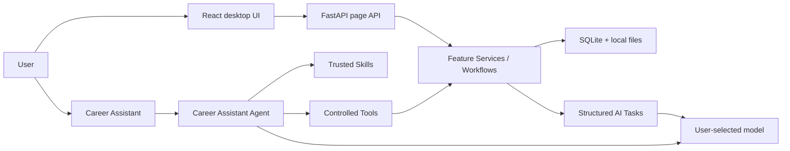

# Contributing to CareerDesk

[简体中文](zh/CONTRIBUTING.md)

CareerDesk welcomes fixes, documentation improvements, new themes, platform testing,
and focused feature proposals. This guide explains how to run the project, understand
its main boundaries, and submit a Pull Request.

## Run from source

Install Git, [uv](https://docs.astral.sh/uv/), Node.js 22, and Python 3.12 or 3.13.

```bash
git clone https://github.com/xinhuangcs/careerdesk.git
cd careerdesk
uv sync --project backend --locked
uv run --project backend python run.py
```

If `frontend/dist` is missing, the first launch builds the frontend from the lockfile.
On macOS, `start.command` is also available; on Windows, use `start.bat`.

For frontend hot reload, run these in separate terminals:

```bash
APP_RUNTIME_MODE=development uv run --project backend \
  uvicorn careerdesk.bootstrap.app:app --reload

npm --prefix frontend ci
npm --prefix frontend run dev
```

## Architecture



- `frontend/` contains the React 19, TypeScript, and Vite interface.
- `backend/src/careerdesk/features/` owns deterministic business capabilities.
- `backend/src/careerdesk/orchestration/` composes cross-feature and durable AI workflows.
- `backend/src/careerdesk/agentic/` contains the assistant, trusted Skills, controlled Tools, and memory.
- `backend/src/careerdesk/platform/` provides database, AI, HTTP, storage, and runtime infrastructure.
- `desktop/` and `scripts/` build and verify self-contained desktop distributions.
- `ai-evals/` contains opt-in real-model evaluation cases and tooling.

The UI and Agent reuse the same public business boundaries. Agent Tools do not access
feature-private repositories directly, and high-risk writes require a reviewable
proposal or explicit page action.

## Submit a Pull Request

1. Fork the repository and create a focused branch from the latest `main`.
2. Make one coherent change and avoid committing `.env`, credentials, real résumés,
   private data, generated runtime data, or unauthorized third-party material.
3. Add or update tests and documentation in proportion to the change.
4. Run the relevant local checks. The usual full gate is:

   ```bash
   uvx ruff@0.15.20 check backend/src backend/tests run.py desktop scripts ai-evals
   uv run --project backend pytest backend/tests
   npm --prefix frontend test
   npm --prefix frontend run typecheck
   npm --prefix frontend run build
   uv lock --check --project backend
   git diff --check
   ```

5. Push the branch and open a Pull Request against `main`. Explain the problem, user-
   visible behavior, tests, and relevant risks or trade-offs.
