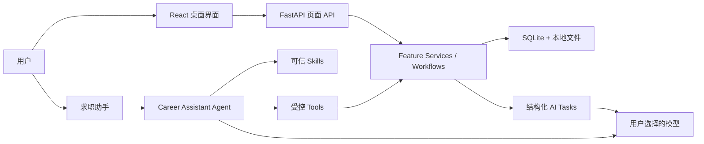

# 参与 CareerDesk

[English](../CONTRIBUTING.md)

CareerDesk 欢迎缺陷修复、文档改进、新主题、平台测试和范围明确的功能建议。本指南只说明如何从源码运行、理解整体架构并提交 Pull Request。

## 从源码运行

需要 Git、[uv](https://docs.astral.sh/uv/)、Node.js 22，以及 Python 3.12 或 3.13。

```bash
git clone https://github.com/xinhuangcs/careerdesk.git
cd careerdesk
uv sync --project backend --locked
uv run --project backend python run.py
```

如果缺少 `frontend/dist`，首次启动会按锁文件构建前端。macOS 也可以运行 `start.command`，Windows 可以运行 `start.bat`。

需要前端热更新时，在两个终端分别运行：

```bash
APP_RUNTIME_MODE=development uv run --project backend \
  uvicorn careerdesk.bootstrap.app:app --reload

npm --prefix frontend ci
npm --prefix frontend run dev
```

## 整体架构



- `frontend/` 是 React 19、TypeScript 和 Vite 界面。
- `backend/src/careerdesk/features/` 拥有确定性业务能力。
- `backend/src/careerdesk/orchestration/` 组合跨 feature 和持久化 AI 工作流。
- `backend/src/careerdesk/agentic/` 包含求职助手、可信 Skills、受控 Tools 和会话记忆。
- `backend/src/careerdesk/platform/` 提供数据库、AI、HTTP、存储和运行时基础设施。
- `desktop/` 与 `scripts/` 负责自包含桌面构建和验证。
- `ai-evals/` 保存显式运行的真实模型评测用例与工具。

界面与 Agent 复用同一业务公共边界。Agent Tool 不直接访问 feature 私有 repository；高风险写入必须生成可审阅方案或经过明确页面动作。

## 提交 Pull Request

1. Fork 仓库，从最新 `main` 创建范围明确的分支。
2. 每个 PR 只完成一组内聚改动；不要提交 `.env`、凭据、真实简历、私有数据、运行时数据或未经授权的第三方材料。
3. 按改动风险补充相应测试和文档。
4. 运行相关本地检查。通常的完整门禁是：

   ```bash
   uvx ruff@0.15.20 check backend/src backend/tests run.py desktop scripts ai-evals
   uv run --project backend pytest backend/tests
   npm --prefix frontend test
   npm --prefix frontend run typecheck
   npm --prefix frontend run build
   uv lock --check --project backend
   git diff --check
   ```

5. 推送分支并向 `main` 创建 Pull Request，说明问题、用户可见变化、测试以及相关风险或取舍。
